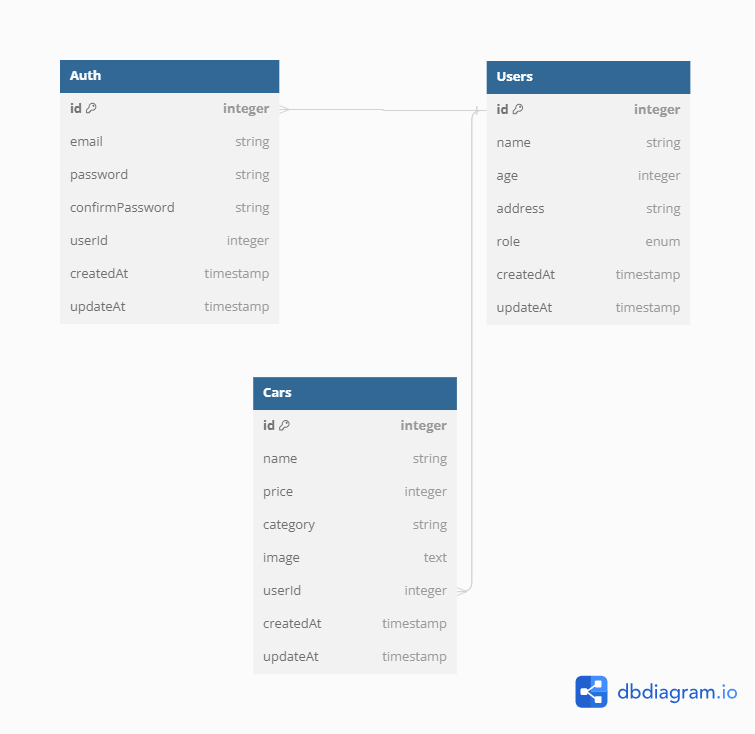

# Step

1. npm Install
2. buat file .env, copy env variable dari .env.example
3. npm run dev

# Login Super Admin

- email: maulanaabdullana123@gmail.com
- password: maulana12345

# DIagram

# Page link

PORT : localhost:9000

API Docs : http://localhost:9000/api-docs
